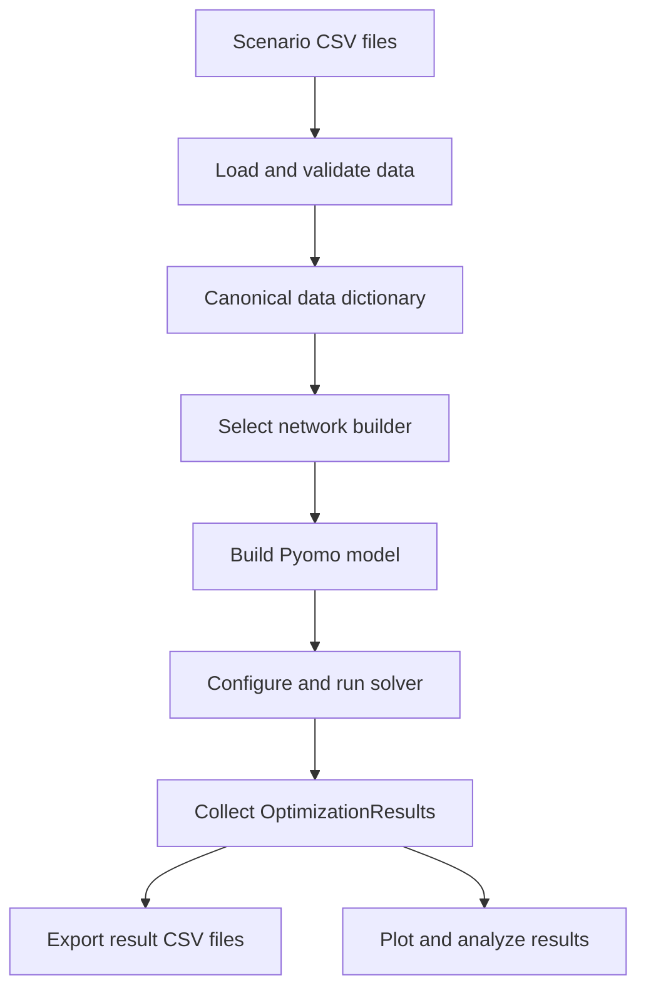
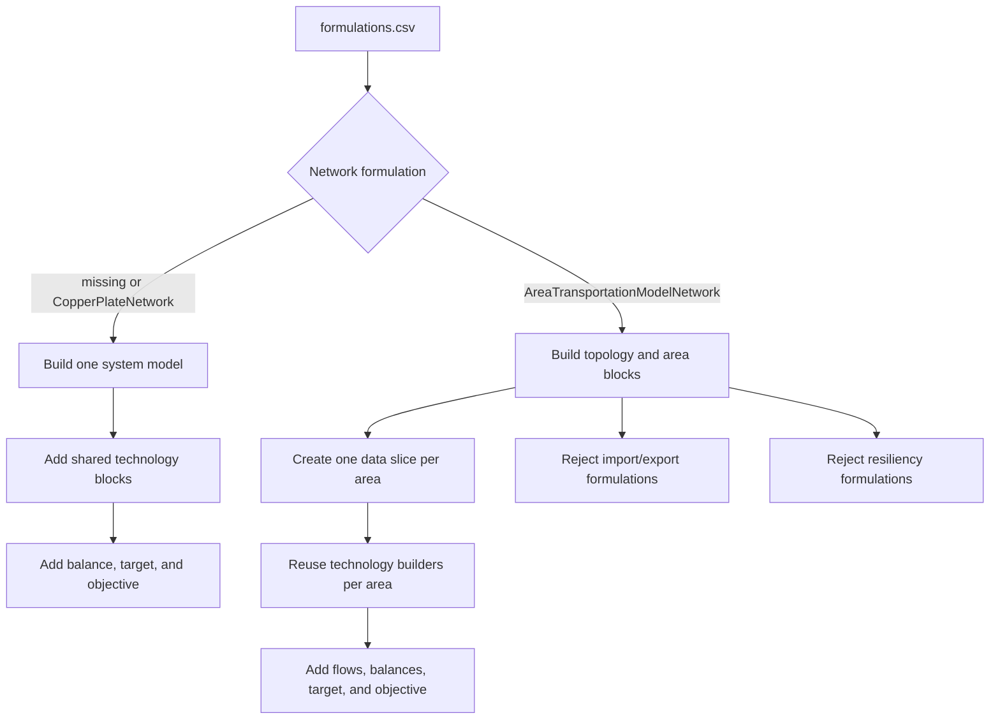
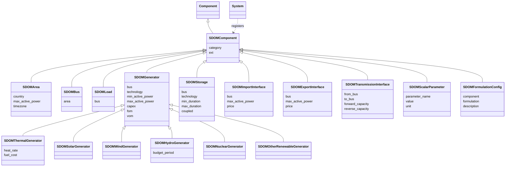
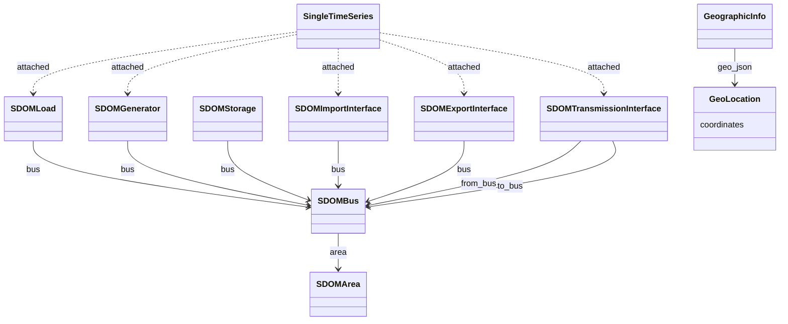
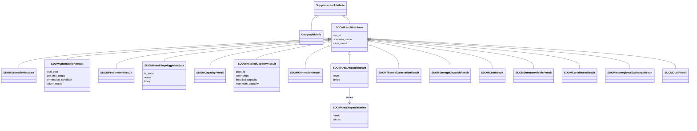

# GUIDELINES FOR DEVELOPING SDOM

## General Guidelines

- Follow [PEP 8](https://www.python.org/dev/peps/pep-0008/) for code style and formatting.
- Write clear, concise, and well-documented code.
- Add docstrings to all public classes, methods, and functions.
- Include unit tests for new features and bug fixes.
- Use descriptive commit messages.
- Open issues or discussions for significant changes before submitting a pull request.
- Ensure all tests pass before submitting code.
- Keep dependencies minimal and document any new requirements.
- Review and update documentation as needed.
- Be respectful and collaborative in all communications.

# clone/fork SDOM repo
- Open VS code and use file -> open folder and select the folder where you want to copy the repo.
- Clone in your local the python version of SDOM repo:
```powershell
git clone https://github.com/Omar0902/SDOM.git
```

# Setting up your enviroment
## Install uv
- Install uv [(A python manager for virtual enviroments, installing packages etc)](https://pypi.org/project/uv/). 
```powershell
pip install uv
```
For further instructions click in the link above.

- Create a virtual enviroment ".venv"
```powershell
uv venv .venv
```
This command creates a new Python virtual environment in the `.venv` directory.

## Install your local SDOM python module and pytest
- To be able to run the tests locally and develop SDOM source code, install your local SDOM module by runing in your powershell terminal (Modify the folder address approprietly):
```powershell
uv pip install -e "C:\YOUR_PATH\SDOM"
```

- It will install also the SDOM dependencies. You should see something like this:

```powershell
Resolved 17 packages in 342ms
      Built sdom @ file:///C:/YOUR_PATH/SDOM
Prepared 7 packages in 7.40s
░░░░░░░░░░░░░░░░░░░░ [0/17] Installing wheels...                                                                                                         warning: Failed to hardlink files; falling back to full copy. This may lead to degraded performance.
         If the cache and target directories are on different filesystems, hardlinking may not be supported.
         If this is intentional, set `export UV_LINK_MODE=copy` or use `--link-mode=copy` to suppress this warning.
Installed 17 packages in 10.95s
 + contourpy==1.3.3
 + cycler==0.12.1
 + fonttools==4.62.1
 + highspy==1.13.1
 + kiwisolver==1.5.0
 + matplotlib==3.10.8
 + numpy==2.4.4
 + packaging==26.1
 + pandas==2.3.3
 + pillow==12.2.0
 + pyomo==6.10.0
 + pyparsing==3.3.2
 + python-dateutil==2.9.0.post0
 + pytz==2026.1.post1
 + sdom==0.1.2 (from file:///C:/YOUR_PATH/SDOM)
 + six==1.17.0
 + tzdata==2026.1
```


- Also, install:
  - [pytests.py](https://docs.pytest.org/en/stable/) to be able to run the tests locally:
```powershell
uv pip install pytest
```

  - run the following codes to install all the requirements to build SDOM documentation:
```powershell
uv pip install -r docs\requirements.txt
```

# Running tests locally
The SDOM python version source code have a folder called "tests". This folder contains all the scripts with the unit tests. 

 **⚠️ Attention:**  
>  - Before to push and/or do a pull request please run locally all the tests scripts and make sure all the tests are passing sucessfully.
>  - Please add unit test for all new features and source code implementations.


- To run all the test files:
```powershell
uv run pytest
```

- To run a test python script you can use:
```powershell
uv run pytest tests/TEST_SCRIPT_NAME.py
```
- For instance, to run the tests of the script called "test_no_resiliency_optimization_cases.py" you should run
```powershell
uv run pytest tests/test_no_resiliency_optimization_cases.py
```
- This is an example of what you should see:
```powershell
uv run pytest tests/test_no_resiliency_optimization_cases.py
================================================================== test session starts ==================================================================
platform win32 -- Python 3.12.4, pytest-8.4.1, pluggy-1.6.0
rootdir: C:\Users\smachado\repositories\pySDOM\SDOM
configfile: pyproject.toml
plugins: anyio-4.8.0, hydra-core-1.3.2
collected 2 items                                                                                                                                                                                                       

tests\test_no_resiliency_optimization_cases.py ..                                                                                                                                                                 [100%]

================================================================== 2 passed in 2.71s ===================================================================
```

# Build the documentation locally

Please update the documentationd in the folder ``docs`` for each new feature implementation you are making in a pull request. The SDOM documentation is based on [sphinx](https://www.sphinx-doc.org/en/master/usage/quickstart.html).


 **⚠️ Attention:**  
>  - Before to push and/or do a pull request please build locally the documentation and make sure it does not have any issues.
>  - Please add Docstrings to all code implementations you include in your contributions.
>  - Add proper documentation for the new features before submit a pull request.

- In order to build locally the documentation and check if your changes are correct you can run:

```powershell
uv run .\docs\make.bat html
```
- to visualize locally the documentation website run
```
start docs\build\html\index.html
```

# Repository Structure and Responsibilities

| Path | Responsibility |
|---|---|
| `src/sdom/__init__.py` | Public Python API, including data loading, model initialization, solver execution, results export, parametric studies, and resiliency evaluation. |
| `src/sdom/io_manager.py` | Loads and validates scenario CSV files, selects formulations, and constructs the canonical data dictionary. For zonal inputs, it also creates `per_area_*` views. |
| `src/sdom/optimization_main.py` | Owns the top-level model dispatcher and the copper-plate and zonal model builders. |
| `src/sdom/initializations.py` | Initializes Pyomo sets, parameters, and time-series structures shared by model builders. |
| `src/sdom/models/` | Defines technology, system, network, import/export, hydro, and resiliency Pyomo formulation blocks. |
| `src/sdom/results.py` | Collects solved Pyomo values into `OptimizationResults` DataFrames and exports result CSV files. |
| `src/sdom/parametric/` | Builds Cartesian parameter sweeps and runs each case through the standard model and solver workflow. |
| `src/sdom/resiliency/` | Evaluates outages from a designed system using baseline dispatch and per-outage simulations. |
| `src/sdom/infrasys_integration/` | Provides a typed Infrasys adapter over the dictionary and Pyomo workflow, plus typed result attributes and queries. |
| `src/sdom/analytic_tools/` | Creates plots and post-optimization analyses from `OptimizationResults`. |
| `tests/` | Covers data loading, formulation construction, solving, results, APIs, documentation, and regression scenarios. `tests/infrasys_integration/` owns adapter parity and result-mapping coverage. |
| `Data/` | Stores representative scenario inputs and test fixtures. |
| `docs/` | Contains the Sphinx configuration, user guide, API reference pages, and contributor documentation. |
| `scripts/` | Provides repository-maintenance and fixture-generation utilities. |
| `.github/` | Contains CI workflows, project instructions, agent definitions, and development skills. |
| `pyproject.toml` | Defines package metadata, dependencies, test configuration, and development tools. |

# Execution Architecture

## CSV and Dictionary Workflow

The standard workflow accepts a scenario directory and uses a dictionary as the
boundary between input processing and model construction. `load_data` reads CSV
files, validates selected formulations, and returns the dictionary consumed by
`initialize_model`. `run_solver` solves the resulting Pyomo model and returns
`OptimizationResults`; `export_results` writes its DataFrames to CSV.



For zonal data, the canonical dictionary includes normalized `per_area_*` data
views. These let zonal model construction reuse the established technology
formulation builders rather than maintaining duplicate implementations.

## Network Formulation Selection

The `Network` row in `formulations.csv` controls the model architecture. If it
is absent, SDOM selects `CopperPlateNetwork`. A copper-plate request must have
one area. `AreaTransportationModelNetwork` builds a top-level transport network
and one technology block for each area.



## Infrasys Integration Workflow

The Infrasys integration is a typed adapter, not a separate optimization
engine. It preserves the standard dictionary and Pyomo workflow while exposing
assets, areas, interfaces, time series, and results as typed System objects.

```mermaid
flowchart LR
  Source[CSV scenario or data dictionary] --> SystemLoad[Build Infrasys System]
  SystemLoad --> System[Typed System]
  System --> SystemBuilder[Initialize model from System]
  SystemBuilder --> Instance[Create bound model instance]
  Instance --> Shared[Use standard model initialization]
  Shared --> Solve[Run standard solver and collector]
  Solve --> Results[OptimizationResults]
  Results --> Attach[Attach typed result attributes]
  Attach --> Queries[Query, reconstruct, or plot results]
```



`load_system` first uses the standard data loader, while `load_system_from_data`
builds the typed System from an existing dictionary. The bound Infrasys model
creates its concrete Pyomo instance through the same `initialize_model` path
used by a dictionary-based run. `add_results_to_system` then maps model results
back to supplemental attributes on the typed System and its components.

## Infrasys Data Model

The Infrasys integration has three distinct layers: registered SDOM components,
time series attached to those components, and supplemental result attributes.
`infrasys.System` is an external registry and lookup container; it is not a
base class of the SDOM component models. SDOM components inherit identity and
the `name` field from `infrasys.Component`. `SDOMComponent` adds a `category`
and an extensible `ext` metadata dictionary. Unit-aware assets additionally use
the `HasUnits` mixin from `r2x_core`.



The primary component relationships define the electrical topology. An area has
one or more buses. Loads, generators, storage, and import/export interfaces
each refer to one bus. A transmission interface refers to its from and to buses.



`SingleTimeSeries` is an external Infrasys model, not an SDOM component
subclass. `load_system_from_data` attaches fixed hourly demand and generation,
VRE capacity factors, and interface capacity and price series to their owning
component. The attachment metadata preserves the source data key and column.
`GeographicInfo` is a supplemental attribute containing the `GeoLocation`
GeoJSON point when geographic data is available.

| Component family | Typed model and role |
|---|---|
| Geographic structure | `SDOMArea` identifies an electrical area. `SDOMBus` binds a named bus to that area. |
| Demand and generation | `SDOMLoad` supplies a demand owner. `SDOMGenerator` holds common technology and cost fields; solar, wind, thermal, hydro, nuclear, and other renewable classes specialize it. Thermal generators require heat rate and fuel cost; hydro can declare a daily or monthly budget period. |
| Storage | `SDOMStorage` stores power and energy capacity/cost data, efficiency, duration, cycling, lifetime, and coupled/decoupled charging behavior. It validates that minimum duration does not exceed maximum duration. |
| External exchange | Import and export interfaces own a bus, maximum power, and price data. Transmission interfaces connect two buses and hold directional capacity data. |
| Configuration | `SDOMScalarParameter` represents a named scalar with unit. `SDOMFormulationConfig` represents one selected component formulation. |

### Infrasys Result Attributes

Every SDOM result is stored as an `infrasys.SupplementalAttribute`, independent
of the component hierarchy. `SDOMResultAttribute` provides `run_id` plus
optional scenario and case names, so several solved runs can coexist in one
System. Result reconstruction selects one run and rebuilds the standard
`OptimizationResults` object for export or plotting.



Run-level metadata, optimization outcomes, topology, problem information, and
aggregate metrics attach to the scenario owner. Area dispatch and curtailment
attach to their `SDOMArea`; plant capacity and thermal dispatch attach to the
matching generator; storage dispatch attaches to matching storage; and
interregional exchange results attach to the matching transmission interface.
When a direct owner is unavailable, result attachment uses the appropriate area
or scenario owner fallback. `optimization_results_from_system` filters those
attributes by run, scenario, and case before reconstructing DataFrames.

# Model Algorithms

## Copper Plate Network

`CopperPlateNetwork` represents one system-wide balancing area. The builder
creates shared Pyomo blocks for VRE, storage, thermal generation, fixed
generation, and enabled optional components. For every hour, a single supply
balance enforces that generation, imports, and storage discharge meet demand,
exports, and storage charging. The model also enforces capacity and operational
limits, a system-wide generation-mix target, and the selected objective-cost
terms.

The solver chooses investment capacities and hourly dispatch jointly. The
results collector returns technology capacities, hourly generation and storage
operation, costs, and other summary metrics in system-level DataFrames.

## Zonal Transportation Network

`AreaTransportationModelNetwork` uses declared or inferred areas plus
`interconnections.csv`, `LineCap_FT.csv`, and `LineCap_TF.csv`. It builds a
top-level network with a signed flow for each line and hour, and uses one child
Pyomo block per area for the reusable technology formulations.

For each line $l$ and hour $h$, flow is constrained by the two directional
capacity limits:

$$
-\mathrm{LineCap}_{TF,l,h} \leq f_{l,h} \leq \mathrm{LineCap}_{FT,l,h}.
$$

Each area has a supply balance that includes net inter-area flow. A single
system-wide generation-mix constraint aggregates eligible generation and demand
across all areas. The objective sums area costs; transmission cost is currently
zero. The zonal collector adds `Area` data, topology metadata, and
interregional-flow results to the standard result surface.

Zonal initialization currently rejects enabled imports/exports and resiliency
formulations. These limitations are intentional guardrails, not input-loader
errors.

# Supporting Workflows

## Parametric Studies

`ParametricStudy` forms the Cartesian product of configured sweeps. Each worker
deep-copies the base data dictionary, applies the case mutations, and calls the
normal `initialize_model` and `run_solver` workflow. Results may be exported per
case and combined for parametric plotting. `SystemParametricStudy` applies the
same approach through an Infrasys System backed by a compatible data dictionary.

## Resiliency Evaluation

`evaluate_resiliency` is a separate post-design workflow. It loads the designed
system, builds and solves a baseline dispatch, then evaluates outages across the
selected hours, optionally in parallel. Its output measures served critical
load, unserved energy, and related resilience metrics rather than replacing the
capacity-expansion result collector.

# Testing and Documentation

Run the test file nearest to the edited behavior before the full suite. The
zonal loader and schema contract are covered by `test_zonal_io_per_area.py` and
`test_zonal_io_lines.py`; zonal formulation and result behavior are covered by
`test_zonal_model_build.py`, `test_zonal_results.py`, and
`test_zonal_io_export.py`. Infrasys model parity and typed results are covered
under `tests/infrasys_integration/`.

Sphinx configuration lives in `docs/source/conf.py`. Build documentation with:

```powershell
uv run .\docs\make.bat html
```

The documentation build test also checks that Mermaid support and the Infrasys
documentation are present. Inspect Mermaid diagrams in a Markdown or Sphinx
preview after editing them; keep diagrams small, use ASCII node identifiers, and
put detailed contracts in nearby prose or tables.