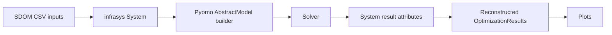
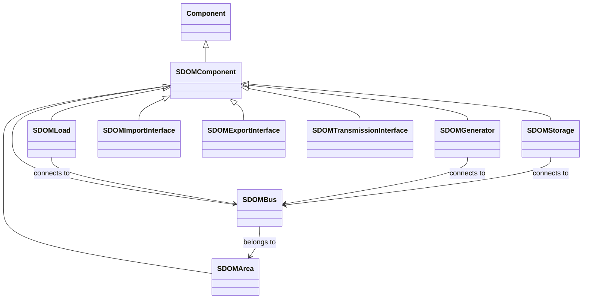
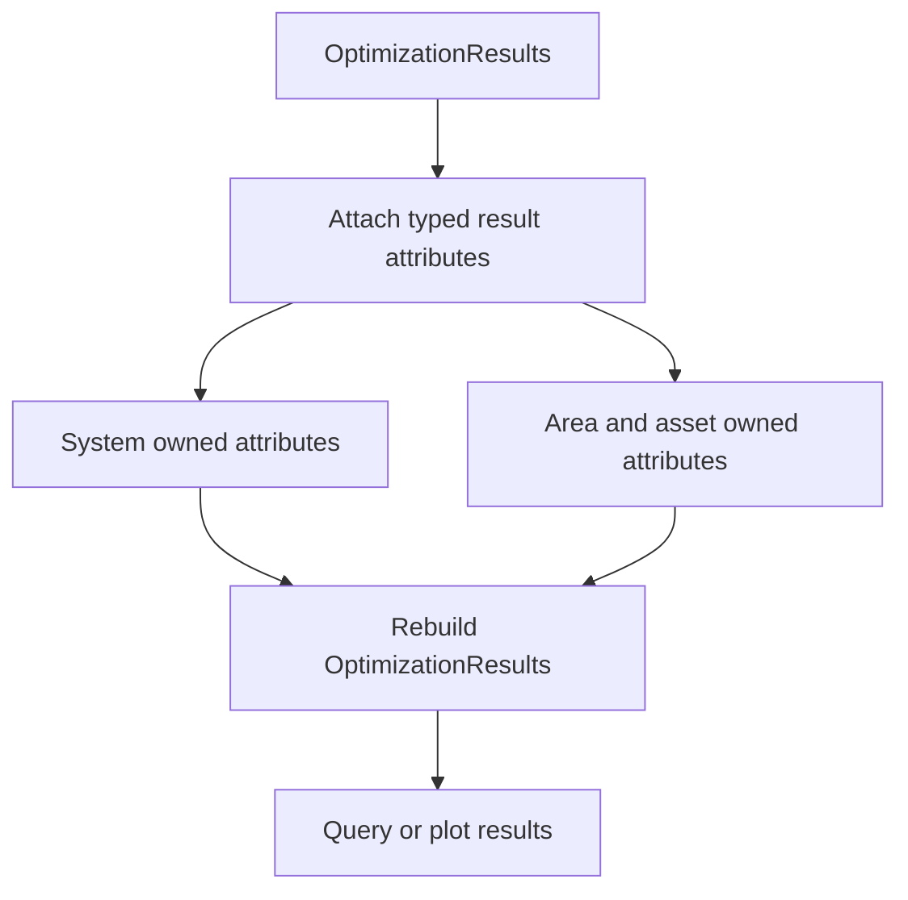
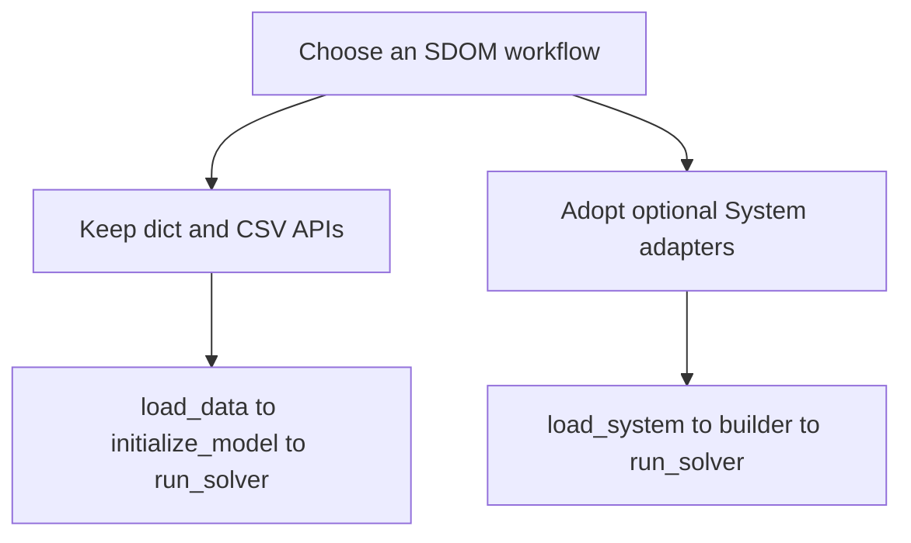
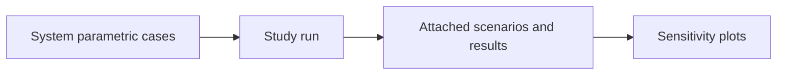

# Infrasys System Workflows

The optional `sdom.infrasys_integration` adapters represent an SDOM case as
an infrasys `System` with typed components, time series, and attached results.
They support system-centric persistence, result inspection, and plotting while
delegating optimization to the established SDOM Pyomo and solver pipeline.



## Data Model

An infrasys `System` owns the typed input components that define an SDOM
scenario. Every SDOM component inherits the shared `name`, optional `category`,
and JSON-serializable `ext` metadata fields from `SDOMComponent`. Loads,
generators, storage, and import/export interfaces connect to a bus; each bus
belongs to an area. Time series are attached to the components that use them.



The generator subclasses are `SDOMThermalGenerator`, `SDOMSolarGenerator`,
`SDOMWindGenerator`, `SDOMHydroGenerator`, `SDOMNuclearGenerator`, and
`SDOMOtherRenewableGenerator`. `SDOMThermalGenerator` requires heat-rate and
fuel-cost inputs, while `SDOMHydroGenerator` can record a budget period.
`SDOMScalarParameter` and `SDOMFormulationConfig` store scalar input values
and formulation selections outside the physical network hierarchy.

### Result Attributes

`add_results_to_system` stores a solved `OptimizationResults` instance as
typed supplemental attributes. Every `SDOMResultAttribute` includes `run_id`
and may include `scenario_name` and `case_name`; use `run_id` to keep several
result sets on one System. Attributes are owned by the System or the component
whose result they describe, then `optimization_results_from_system` rebuilds
the legacy-compatible result object.



| Result attribute | Owner | Key fields |
| --- | --- | --- |
| `SDOMScenarioMetadata` | System | Caller-supplied JSON-serializable `metadata`. |
| `SDOMOptimizationResult` | System | `total_cost`, `gen_mix_target`, `termination_condition`, `solver_status`. |
| `SDOMProblemInfoResult` | System | Solver problem-info `key` and scalar `value`. |
| `SDOMResultTopologyMetadata` | System | `is_zonal`, ordered `areas`, and transmission `lines`. |
| `SDOMCapacityResult` | System or area | `technology`, `capacity_type`, `value`, `unit`, and optional `area`. |
| `SDOMGenerationResult` and `SDOMCurtailmentResult` | System or area | `technology`, horizon total in MWh, and optional `area`. |
| `SDOMCostResult` | System or area | `cost_type`, optional `technology`, `value`, `unit`, and optional `area`. |
| `SDOMSummaryMetricResult` | System | Original `row_order`, `metric`, optional `technology`, `run`, `optimal_value`, and `unit`. |
| `SDOMInstalledCapacityResult` | Generator or storage | `plant_id`, `technology`, `row_order`, installed and maximum MW, and capacity fraction. |
| `SDOMAreaDispatchResult` | Area | Ordered `hours`, optional `scenario`, and metric series aligned with those hours. |
| `SDOMThermalGenerationResult` | Thermal generator | Ordered `hours` and aligned `generation_mw`. |
| `SDOMStorageDispatchResult` | Storage | Ordered `hours`, `row_order`, and aligned charge MW, discharge MW, and state-of-charge MWh. |
| `SDOMInterregionalExchangeResult` | Transmission interface | Ordered `hours`, signed and directional flow MW, capacities, and directional utilization. |
| `SDOMDualResult` | System or area | `constraint_name`, dual `value`, and optional `hour` and `area`. |

Hourly result vectors are validated to match their `hours` vector. Area dispatch
also rejects duplicate metrics. `GeographicInfo` is a separate supplemental
attribute for component location; it stores a GeoJSON `Point` and an optional
data source, rather than optimization output.

## Compatibility policy

System APIs are opt-in adapters. Existing `load_data`, `initialize_model`,
`run_solver`, and legacy `ParametricStudy` dict/CSV workflows remain supported
and retain their public API compatibility. Choose a System workflow when typed
infrasys components, persistence, or System-attached results are useful; it is
not a required migration for existing scripts.



## Copperplate flow

Load a single-area CSV scenario directly into a System, create the
copperplate builder, instantiate it once, solve, and attach the returned
`OptimizationResults`. `Data/no_exchange_run_of_river` is a repository
example input directory.

```python
from sdom import get_default_solver_config_dict, run_solver
from sdom.infrasys_integration import (
    add_results_to_system,
    optimization_results_from_system,
    plot_system_results,
    query_result_attributes,
)
from sdom.infrasys_integration.make_system import load_system
from sdom.infrasys_integration.pyomo_builder import (
    initialize_copperplate_model_from_system,
)

system = load_system("Data/no_exchange_run_of_river", name="copperplate")
builder = initialize_copperplate_model_from_system(system, n_hours=24)
model = builder.create_instance()

solver_config = get_default_solver_config_dict(
    solver_name="highs", executable_path=""
)
results = run_solver(model, solver_config, case_name="copperplate")

add_results_to_system(system, results, run_id="copperplate-24h")
restored_results = optimization_results_from_system(
    system, run_id="copperplate-24h"
)
attributes = query_result_attributes(system, run_id="copperplate-24h")
plot_system_results(system, run_id="copperplate-24h", output_dir="results/copperplate")
```

`restored_results` is an `OptimizationResults` object reconstructed from the
supplemental attributes; `attributes` contains the corresponding typed result
attributes. Use a distinct `run_id` for each result set retained on a System.

## Zonal flow

Use `initialize_model_from_system` for data whose network formulation and
areas define the model, including the repository's `Data/zonal_test` example.
The solver, attachment, reconstruction, and plot APIs are the same. When
results are zonal, `plot_system_results` also emits area stacks and line-flow
plots.

```python
from sdom import get_default_solver_config_dict, run_solver
from sdom.infrasys_integration import (
    add_results_to_system,
    optimization_results_from_system,
    plot_system_results,
)
from sdom.infrasys_integration.make_system import load_system
from sdom.infrasys_integration.pyomo_builder import initialize_model_from_system

system = load_system("Data/zonal_test", name="zonal")
model = initialize_model_from_system(system, n_hours=24).create_instance()
solver_config = get_default_solver_config_dict(
    solver_name="highs", executable_path=""
)
results = run_solver(model, solver_config, case_name="zonal")

add_results_to_system(system, results, run_id="zonal-24h")
restored_results = optimization_results_from_system(system, run_id="zonal-24h")
plot_system_results(system, run_id="zonal-24h", output_dir="results/zonal")
```

## System persistence and builder lifecycle

The tested infrasys JSON persistence format is `System.to_json(path,
overwrite=True)` and `System.from_json(path)`. It round-trips System
components, associations, and queryable time-series metadata for both the
copperplate and zonal examples.

```python
from pathlib import Path

from infrasys import System
from sdom.infrasys_integration.make_system import load_system

system = load_system("Data/no_exchange_run_of_river", name="copperplate")
path = Path("results/copperplate-system.json")
system.to_json(path, overwrite=True)
loaded_system = System.from_json(path)
```

Build a model only after completing System adapter operations that require the
retained compatibility source data. Calling `create_instance()` releases that
backing source data from both the builder and System. Consequently,
`system_to_data_dict`, `SystemParametricStudy`, and the System sweep helpers
must be used before model instantiation. JSON persistence is shown separately
above; do not assume an arbitrary deserialized System retains the adapter's
in-memory source-data dictionary.

## System parametric studies

`SystemParametricStudy` delegates case execution to the legacy
`ParametricStudy`, returning `list[OptimizationResults]`. Attach its results to
the original System before creating sensitivity plots. On Windows, place
`study.run()` behind an `if __name__ == "__main__":` guard because the legacy
study may start worker processes.



```python
from sdom import get_default_solver_config_dict
from sdom.infrasys_integration import (
    SystemParametricStudy,
    add_parametric_results_to_system,
    plot_system_parametric_results,
)
from sdom.infrasys_integration.make_system import load_system


def main():
    system = load_system("Data/no_exchange_run_of_river")
    solver_config = get_default_solver_config_dict(
        solver_name="highs", executable_path=""
    )
    study = SystemParametricStudy(
        system, solver_config, n_hours=24, output_dir="results/parametric", n_cores=1
    )
    study.add_genmix_sweep([0.8, 1.0])
    results = study.run()

    add_parametric_results_to_system(
        system, study, results=results, run_id="genmix-24h"
    )
    plot_system_parametric_results(
        system,
        run_id="genmix-24h",
        group_by="GenMix_Target",
        output_dir="results/parametric",
    )


if __name__ == "__main__":
    main()
```

The study stores per-case metadata and the attachment assigns stable scenario
identifiers within `run_id`; `plot_system_parametric_results` reconstructs
those cases and delegates rendering to SDOM's sensitivity plotter.

## Migrating a dict workflow

Keep the legacy path unchanged, or replace only its loading and model-building
steps with their System equivalents. The solver still receives the concrete
Pyomo model, and result export remains available through existing SDOM APIs.

| Legacy dict/CSV workflow | Optional System workflow |
| --- | --- |
| `data = load_data(path)` | `system = load_system(path)` |
| `model = initialize_model(data, n_hours=...)` | `model = initialize_model_from_system(system, n_hours=...).create_instance()` |
| `results = run_solver(model, solver_config)` | Same `run_solver(model, solver_config)` call |
| Use `OptimizationResults` directly | Attach, query, reconstruct, and plot through System adapters |
| `plot_results(results, output_dir=...)` | `add_results_to_system(system, results, run_id=...)`, then `plot_system_results(system, run_id=..., output_dir=...)` |
| `plot_parametric_results(study, results, ...)` | `add_parametric_results_to_system(system, study, results=results, run_id=...)`, then `plot_system_parametric_results(system, run_id=..., group_by=..., output_dir=...)` |

For an explicit dict-to-System transition, `load_system_from_data(data)` builds
a System from the dictionary returned by `load_data`. Before instantiation,
`apply_scalar_sweep_to_system` and `apply_time_series_sweep_to_system` create
new Systems with copied backing data; they do not mutate the source System.

See the [infrasys integration API](../api/infrasys_integration.md) for the
complete adapter reference.